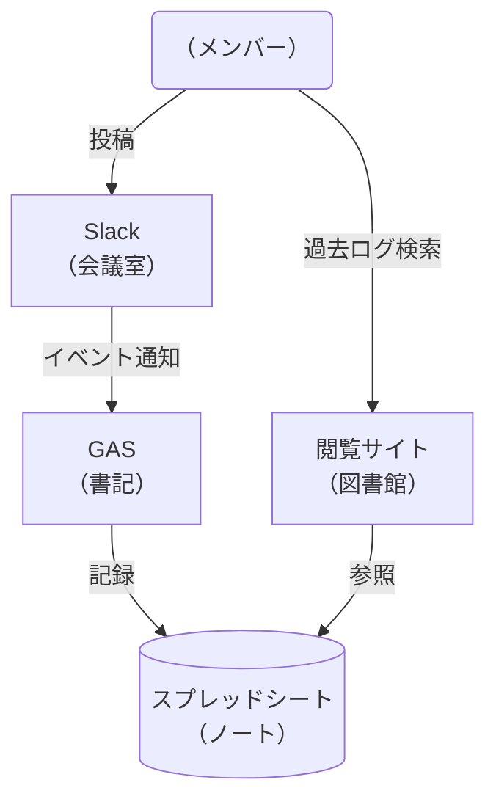

# 0. はじめに
突然ですが，みなさんの所属している団体では **Slack** を使っていますか？
私が所属する技大祭実行委員会では，日常的にSlackを利用しています．

便利ですよね，Slack．
リアクション機能で気軽にコミュニケーションが取れるし，Bot連携も豊富．
もはや生活インフラの一部と言っても過言ではありません．

しかし，そんな最強ツールSlackにも，フリープランには致命的な問題点があります．
そうです，**「90日でメッセージが消えていく」** 問題です．

### 「去年これどうやって決めたんだっけ？」
よく聞く言葉です．
しかし，この時にはもう遅い．メッセージは非表示になっています．

いくらログを検索しても，"何も見つかりませんでした" の文字が虚しく表示されるだけ…
これではノウハウが蓄積されず，毎年同じ失敗を繰り返してしまいます．

**「有料プランにすればいいじゃん」**
その通りです．ぐうの音も出ません．しかし，私たちは非営利の学生団体．
毎月人数分の料金を払い続ける財力など，どこにもありません．
というか，そんなお金があったら，学園祭をもっと盛り上げることに使いたいです．

### 「お金をかけずにログを残したい！」

そんなわがままを叶えるために，今回は **無料枠** をフル活用して，
**「完全無料でSlackのメッセージを永久保存＆閲覧できるシステム」** を作ってみました！

# 1. できること・できないこと
### できること
1. Slackのメッセージを，自動で記録できます
2. パブリック・プライベートチャンネル・グループDMのメッセージを記録できます
3. 導入以前のメッセージ（まだ表示されているもの）を記録できます．
4. すでに非表示になってしまった，パブリックチャンネルのメッセージを復元できます

### できないこと
1. メッセージは送れません（閲覧専用です）
2. すでに非表示になったプライベートチャンネル・DMのメッセージは復元できません
3. 個人間のDMは記録できません

# 2. 仕組み

「システムを作る」というと難しそうに聞こえるかもしれませんが，やっていることは単純です．

イメージとしては，**「会議室（Slack）に，専属の書記（Bot）を常駐させる」** だけです．

*   **会議室**：Slack
*   **書記**　：Bot + GAS
*   **ノート**：Google スプレッドシート

メンバーが会話するたびに，書記がその内容をせっせとノートに書き写してくれる．
そんな仕組みを作れば，会話が消えることはありません．

### 構成図

今回作ったシステムの全体像はこんな感じです．

1.  **Slack （Event API）**：誰かが発言したら，「発言があったよ！」と知らせる
2.  **GAS （Google Apps Script）**：知らせを受けて，内容を書き留める（書記）
3.  **Spreadsheet**：データを溜め込む場所（ノート）
4.  **Next.js + Vercel**：溜まったデータを綺麗に見るためのサイト（図書館）

この構成のポイントは，**「とにかく楽で，無料であること」**
Googleの無料ツールと，Vercelという無料ホスティングサービスを組み合わせることで，
**ランニングコスト0円** を実現しました．

# 3. 必要な「4つの道具」

今回使うのは，以下の4つの道具です．

1.  **Google スプレッドシート**
    みんな大好きスプレッドシート．これを「データベース」として使います．
    専門的なデータベースソフトを使わない理由は，**「非エンジニアでも管理できるから」** です．
    管理者が全員エンジニアとは限りませんし，エンジニアがいない団体でも，Slackのログは
    管理したいですよね．
    今回のシステムは，「webアプリを作らなくても使える」というところがポイントです．

2.  **Google Apps Script （GAS）**
    Googleが提供しているプログラミング環境です．
    スプレッドシートと相性抜群で，サーバーを自分で建てなくてもコードが動く，
    魔法のようなツールです．
    今回はコピペなので，あまり実感が湧かないかもしれませんが，とても便利です．

3.  **Slack Bot**
    無料プランで泣いた私たちを救う，最高のヒーローです．
    これがなければ，そもそもメッセージを取得できません．
    メッセージが投稿されると，GASを経由して，スプレッドシートに書き込んでくれます．

4.  **Vercel**
    スプレッドシートの内容をより見やすくするため，webアプリを開発します．
    このWebサイトを無料で公開できるサービスです．

# 4. 構築の流れ（ざっくりと）

ここからは，実際にどうやって作ったのかを紹介します．
今回はブログなので，ざっくりとした流れだけ書きます．
実際に使ってみたいと思った方は，詳細な手順も公開しているので，参考にしてみてください．
https://caring-sort-206.notion.site/Slack-2fa5c85cb41f80e78652cc5e988db636?pvs=74

「難しそう…」と思うかもしれませんが，安心してください．
 私 ~~ではなくAI~~ が用意したコードを **コピペするだけ** で動くようにしてあります．

## Step 1：ノートの準備（スプレッドシート）

まずは，ログを保存するためのスプレッドシートを新規作成します．
これが全てのデータの保存先になります．

## Step 2：書記の教育（GAS）

スプレッドシートのメニューから「Apps Script」を開き，プログラムを書き込みます．
ここで難しいコードを書く必要はありません．
以下のリンクにあるコードを **コピペ** してください．

`コード.gs`
https://github.com/KokiWakatsuki/slack-message/blob/main/integrations/gas/code.js
`Sidebar.html`
https://github.com/KokiWakatsuki/slack-message/blob/main/integrations/gas/sidebar.html

最後に，忘れずに **スクリプトプロパティ** を設定します．
GASの設定画面から，以下の3つを追加してください．

- `SPREADSHEET_ID`： 先ほど作ったスプレッドシートのID
- `SLACK_BOT_TOKEN`： 後で取得するので一旦 `-` とか入れておく
- `EXPORT_FOLDER_ID`： （任意）Slackのエクスポートデータ ※詳細はNotion参照

## Step 3：会議室への招待（Slack App）

Slackの管理画面で「新しいアプリ（Bot）」を作成します．
ここで重要なのが，**「Event Subscriptions」** という設定です．

これもマニュアル通りにコピペで終わらせましょう．
「App Manifest」という機能を使います．

1. https://api.slack.com/apps にアクセス
2. 「Create New App」 > 「From an app manifest」
3. JSONで，以下をコピペ
https://github.com/KokiWakatsuki/slack-message/blob/main/integrations/slack-api/manifest.json

ただし，以下の3箇所だけ自分の環境に合わせて書き換えてください．

- **`display_information.name`**： Botの名前
- **`features.bot_user.display_name`**： 表示名
- **`settings.event_subscriptions.request_url`**： GASで作ったアプリのURL

これで，必要な権限設定などが一瞬で完了します．

⚠️ 注意 ⚠️
強めの権限が設定されています．
監視されたくないデータなどがあれば不要な権限を削除してください．
基本的にはこのままで問題ないです．

## Step 4：webアプリの開発
ここからは，エンジニアの方に作業をお願いするのがいいかもしれません．
しかし，少しだけgitを勉強すれば非エンジニアの方もきっとできるはずです．
https://zenn.dev/k_wakatsuki/articles/a980f66b4dda22
gitに関する記事も書いているので，挑戦したい方はぜひ．

では，手順に戻りましょう．
1. 以下のリポジトリをcloneしてください．
https://github.com/KokiWakatsuki/slack-message
2. colenが終わったら，リモートリポジトリを，自分のものに設定し直してください．
3. github連携したvercelでデプロイします．

これで，ほぼコピペだけで，Slackのログが監視できるようになりました．

# 5. まとめ

今回は簡単な技術を使用して，Slackのログを記録するアプリを作成しました．

どこの団体でも，最初はチャットツールの選定を行うと思います．
Slackは便利な一方で，ログが残らないところがデメリットとして挙げられると思います．

「ログさえ残ってくれればSlackを選ぶのになぁ」
そう思った方は多いと思います．

そんな方がこのブログを読んで，Slackを選ぶ理由の1つになれたらいいなと思います．