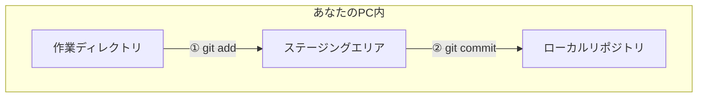
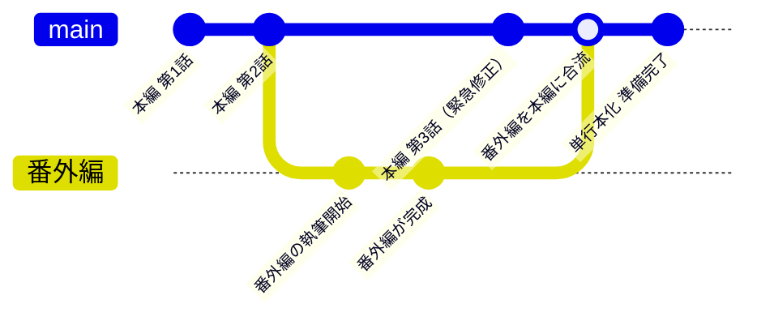
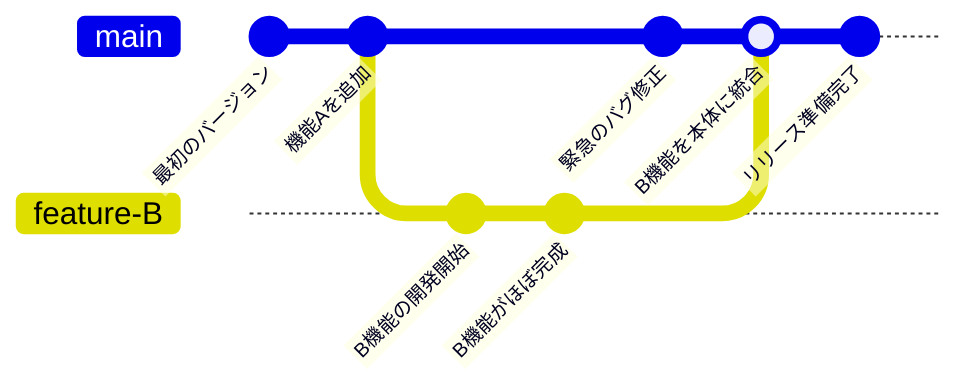
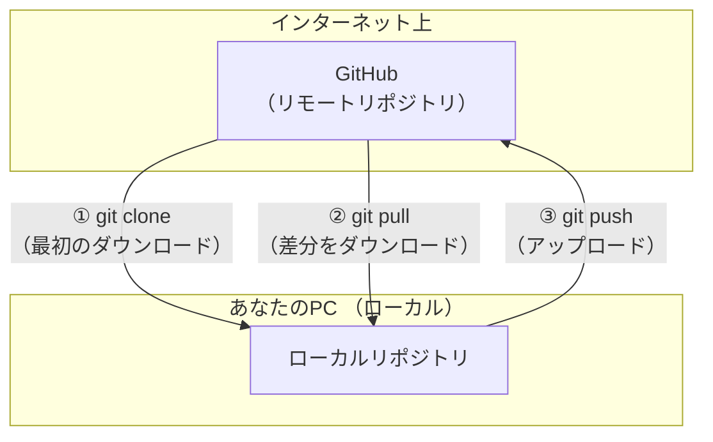

# 0. はじめに
今回は，プログラマーにとって必須のツール，
「**Git（ギット）**」と「**GitHub（ギットハブ）**」についてのブログを書きたいと思います．

みんな便利って言うけど，なんか難しくてよくわからない...という方のために，
なるべくわかりやすく説明していきます．

> 「昨日まで動いていたのに，今日修正したら動かなくなった！
>　元に戻したいけど，どこを直したか覚えてない…」
> 「この機能を追加する前の，あの完璧な状態に時間を戻せたら…」
> 「友達と一緒に開発したいけど，どのファイルが最新版なのか分からなくなってしまった…」
> 「`report_final.pdf`，`report_final_ver2.pdf`，`report_final_really_final.pdf`…
>　もうどれが本当の最終版かわからない！」

こんな，プログラミング学習中に誰もが一度は経験する「あるある」．
そんな悩みを解決してくれるのが**Git**と**GitHub**です．

---

# 1. Git基礎編

## 1.1 Gitってなに？

**Git**とは，「**バージョン管理システム**」です．
一言でいえば，「**ファイルの変更履歴を記録し，いつでも過去の状態に戻せるようにする**」ための
ツールです．

    例え話：ゲームのセーブポイント🎮

    RPGなどのゲームで，ボス戦の前にセーブしますよね？
    Gitもそれと全く同じです．
    
    「この機能は上手く実装できたぞ！」というキリの良いタイミングでセーブ（コミット）しておけば，
    もしこの先，新しい機能の追加で予期せぬバグを生んでしまっても，最後にセーブした
    安全な場所からやり直せるのです．

## 1.2 Gitは「差分」を記録する

Gitを理解する上で非常に重要なのが，
「Gitは**ファイルの全コピーではなく，変更のあった部分（差分）だけを記録している**」
という点です．

    例え話：原稿に赤ペン✒️

    昔ながらの校正作業を思い浮かべてみてください．
    
    直したい行だけに赤を入れるので，変わった所が一目で分かります．
    また，赤ペンの内容を反映させれば，最新版が完成します．
    逆に作業途中の赤字をたどれば，「いつ・誰が・何を直したか」も丸わかりです．
    
    このやり方をそのままデジタルに移したのが，「変わった部分だけ記録していく」仕組みです．

    元の文章を何度もコピーせずに済むから軽いし，いつでも過去の状態に戻れる．
    そんなメリットがあるわけです．

このように，Gitは変更点（**差分**）だけを記録し，各セーブポイントではプロジェクト全体の
完璧な状態（**スナップショット**）を記憶しています．
これにより，

* **保存容量を大幅に節約できる**
    記録するのは小さな「差分」だけなので，何百，何千という変更履歴を保存しても，
    容量の心配はほとんどありません．
* **変更履歴の管理が非常に高速**
    ファイルを丸ごと扱うのではなく，小さな差分情報だけを扱うため，過去のバージョンに
    戻ったり，ブランチ（後述）を切り替えたりする操作が一瞬で完了します．

無駄を徹底的にそぎ落とした，この「差分の管理」と「スナップショット」という考え方こそが，
Gitの強みなのです．

## 1.3 Gitにおける3つのエリア

Gitは，変更を記録するために，**あなたのPC内**に3つの作業エリアを用意します．

なぜ3つもエリアが必要なのでしょうか？
それは，「**意味のある単位で，的確な変更履歴を残すため**」です．

雑多な変更を一度に記録するのではなく，意図を込めてセーブデータを作るための，
よく考えられた仕組みなのです．

以下が3つの作業エリアです．

1. **作業ディレクトリ**
    あなたが普段，エディタでファイルを開いてコードを書いている場所です．
2. **ステージングエリア**
    作業ディレクトリでの変更のうち，「この変更を記録したい」と選んだものを
    一時的に置いておく場所です．
3. **ローカルリポジトリ**
    ステージングエリアにある変更の記録を，正式な記録として保管しておく場所です．

「記録したくない変更なんてあるわけないじゃないか」と思う方もいるかもしれません．
では，なぜ記録したい変更を選ぶ必要があるのでしょうか？

    具体例：見つけてしまったミス❌

    ログイン機能を実装しているときに，たまたま別のファイルの誤字を見つけてしまいました．
    「忘れないうちに修正しておこう」そう考えたあなたは，誤字を修正しました．

    この変更内容を「ログイン機能実装+誤字修正」と記録することにしました．
    しかし，ログイン機能を最初から作り直すことになってしまったあなたは，変更履歴を巻き戻しました．

    この後，無事にログイン機能は実装できましたが，あとでまた誤字が見つかってしまいました．

このような場合，ステージングエリアの重要性がわかるかと思います．
途中で誤字を修正した場合でも，ログイン機能だけで変更を記録し，誤字修正という記録を
作れるのです．

図解すると以下のようになります．

この「**①選んで （`add`）**，**②記録する （`commit`）**」という2段階のステップが，
美しい変更履歴を作る秘訣なのです．

## 1.4 Git基本操作：最初のセーブ

では，実際にコードをセーブしてみましょう．

1.  **`git init`**
Gitの管理を始めたいフォルダで最初に一度だけ実行します．
「ここでGit日記をつけ始めるぞ！」という宣言で，ローカルリポジトリ（`.git`フォルダ）が作られます．
2.  **ファイルを作成・編集**
いつも通りにファイルを作成，編集します．
3.  **`git add <ファイル名>`**
変更したファイルを選んでステージングエリアにあげます．
「この変更を記録候補に入れる！」という意思表示です．
4.  **`git commit -m "セーブメッセージ"`**
ステージングエリアにある変更を，メッセージ付きでローカルリポジトリに記録します．
このメッセージは「なぜこの変更をしたのか」が**第三者にもわかるように書く**のが鉄則です．
（悪い例「修正」，良い例「ナビゲーションバーのボタンが中央に寄るようにCSSを修正」）
見返した時に，あなたを助ける最も重要な工程です．

---

# 2. ブランチ編 ～安全な実験室の作り方～

Gitの機能の一つである「**ブランチ**」について説明します．

## 2.1 なぜブランチが必要？

もしあなたが
「**今のプログラムは安定して動いているから，これを壊さずに新しい機能を試したいな**」
と思ったらどうしますか？

フォルダを丸ごとコピーして「`my-project-backup`」のような名前で保存しますか？
それでは管理が煩雑になり，うまくいった後に元のファイルに修正を反映させるのも一苦労です．

    例え話：漫画家とアシスタントの共同作業🖋️

    `main`ブランチが，漫画家先生が描く本編のストーリーだとします．

    ある時，先生はアシスタントAさんに「特別番外編を描いてみて」と頼みました．
    アシスタントAさんは，本編とは別の`番外編`ブランチを作り，そこで作業を始めます．
    
    一方，別のアシスタントBさんは，新しいキャラクターのデザインを
    `新キャラデザ`ブランチで試行錯誤しています．

    このようにブランチを使えば，全員が本編の原稿（`main`）を汚すことなく，それぞれの作業に
    集中できます．
    そして，番外編が面白く描けたら，それを本編に合流（マージ）して，正式な作品の一部にすることが
    できるのです．

ブランチを使う最大のメリットは，
「**本体（メインのバージョン）に影響を与えることなく，安全に新しい挑戦ができる**」
ことです．

チーム開発では，Aさんの変更とBさんの変更が衝突（同じ場所を変更してしまうこと）する
大惨事（**コンフリクト**）を防ぎ，開発をスムーズに進めるために不可欠な機能です．

## 2.2 ブランチの基本操作

* **`git branch <ブランチ名>`**
新しいブランチ（パラレルワールド）を作成します．
* **`git switch <ブランチ名>`** （または **`git checkout <ブランチ名>`**）
作業するブランチ（世界線）を切り替えます．
このコマンドを実行すると，あなたの作業ディレクトリ内のファイルが，指定したブランチの
最新の状態に一瞬で書き換わります．
* **`git merge <合流させたいブランチ名>`**
あるブランチでの変更内容を，今いるブランチに合流させます．

今は「こんな便利な機能があるんだな」と，**安全に試行錯誤できる魔法のようなものだ**と
覚えておくだけで大丈夫です．

---

# 3. GitHub基礎編

お待たせしました！
いよいよ「**GitHub**」の登場です．

この章では，ローカルリポジトリのデータをオンライン上で管理する方法を説明します．
## 3.1 GitHubってなに？

GitHubは，Gitのローカルリポジトリをインターネット上で保存・共有できる**ウェブサービス**です.

あなたのPCの中にあるセーブデータのアルバム（ローカルリポジトリ）を，ネット上の
特別な棚（**リモートリポジトリ**）に置くことができます．

    例え話：コード専門のクラウドストレージ ＋ SNS機能☁️👥

    GoogleDriveやDropboxのように，GitHubはあなたのコードをネット上にバックアップしてくれます．
    しかし，それだけではありません．
    
    他の人のコードを見て「いいね！」を付けたり（Star），自分のコードを公開して世界中の人から
    フィードバックをもらったりできる，プログラマー専用のSNSのような側面も持っています．

GitHubを使う主な理由は大きく3つです．

1.  **バックアップ**
PCが突然壊れても，GitHubという安全な場所にコードがあれば，いつでも復元できます．
大切なコードを守るための，最も信頼できる保険です．
2.  **共有とポートフォリオ**
世界中の開発者が自分のコードを公開しており，それを見て学ぶこともできます．
また，自分の作品を公開すれば，完成品だけでなく
「**どのような考えで，どのような手順で開発を進めたか**」という過程そのものが，
あなたのスキルを証明する強力な「ポートフォリオ」になります．
3.  **コラボレーションの基盤**
チーム開発を円滑に進めるための様々な機能（後述するPRなど）が提供されており，
世界中のプロジェクトがGitHubをプラットフォームとして開発を進めています．

## 3.2 GitHubの基本操作

GitHubを使い始めるには，まず[公式サイト][ https://github.com/ ]で
アカウントを作成しましょう．

* **`git clone <URL>`**
GitHub上にあるリモートリポジトリを，まるごと自分のPCに複製してきます．
* **`git push`**
ローカルリポジトリで行ったコミット（セーブデータ）を，リモートリポジトリに
アップロードします．
* **`git pull`**
リモートリポジトリの最新の変更を，自分のローカルリポジトリにダウンロードしてきて
統合します．

## 3.3 PR（プルリクエスト）

これはチーム開発で輝く，GitHubの素晴らしい機能です．
コラボレーションの心臓部と言っても過言ではありません．

**例え話：レポートの相互レビュー📝**

    あなたがレポートを書き終えたとします．いきなり教授に提出するのは少し不安ですよね．
    そこで，あなたはまず友人に「ちょっとこれ読んでみてくれない？」と下書きを見せます．
    これが「PR（プルリクエスト）」です．

    友人は
    「ここの日本語，ちょっとおかしいかも」
    「このデータ，出典はどこ？」
    といった的確な指摘（**レビュー**）をしてくれます．
    
    あなたはそのフィードバックを元にレポートを修正し，完璧な状態に仕上げてから，自信を持って
    教授に提出（**マージ**）します．

プルリクエストは，このようにコードの品質をチーム全体で高めるための，非常に洗練された
仕組みなのです．

---

# 4. 簡単ハンズオン！

さあ，理屈を学んだら実践です！ここまでの流れを体験してみましょう．

1.  **ローカル作業**
    1.  PCに作業用のフォルダを作り，その中で `git init` を実行．
    2.  `hello.txt` を作成し，「Hello Git!」と書く．
    3.  `git add hello.txt` を実行．
    4.  `git commit -m "最初のコミット"` を実行．

2.  **GitHubでの準備**
    1.  GitHubのサイトで，新しいリポジトリを作成．
    2.  作成後に表示される `https://github.com/あなたの名前/リポジトリ名.git` という
    URLをコピー．

3.  **ローカルとリモートを接続**
    1.  PCのターミナルで `git remote add origin <コピーしたURL>` を実行．
    2.  `git push -u origin main` を実行してアップロード．

これで，GitHubのあなたのリポジトリページを更新してみてください．
`hello.txt` が表示されていれば，冒険の第一歩は成功です！

---

# 5. まとめ

今回はGitとGithubについてまとめてみました．

最初は覚えることが多く感じるかもしれませんが，プログラマーにとってGit・GitHubは，
作家がキーボード入力のスキルを身につけるのと同じくらい，基本的で不可欠な技術です．

毎日少しずつ触れることで，必ずあなたの強力な武器になります．
失敗を恐れずに，どんどん`commit`して`push`していきましょう！

# 付録1：よく使うGitコマンド早見表

| コマンド | 意味 |
| --- | --- |
| `git init` | 新しくローカルリポジトリを作成する |
| `git status` | リポジトリの状態（変更ファイルなど）を確認する |
| `git add <ファイル名>` | 指定したファイルの変更をステージングエリアに追加する |
| `git add .` | 変更された全てのファイルをステージングエリアに追加する |
| `git commit -m "メッセージ"` | ステージングエリアの変更をローカルリポジトリに記録する |
| `git log` | コミットの履歴を表示する |
| `git switch <ブランチ名>` | 指定したブランチに切り替える |
| `git merge <ブランチ名>` | 指定したブランチの変更を現在のブランチに統合する |
| `git clone <URL>` | リモートリポジトリをローカルに複製する |
| `git push` | ローカルの変更をリモートにアップロードする |
| `git pull` | リモートの変更をローカルにダウンロードして統合する |

# 付録2：Git Graph
Gitのコマンドって覚えるの大変ですよね．
そんなあなたには**Git Graph**をオススメします．

**Git Graph**とは，VSCodeの拡張機能で，Gitの操作をGUIで行うことができます．
気になった方はぜひ調べてみてください！